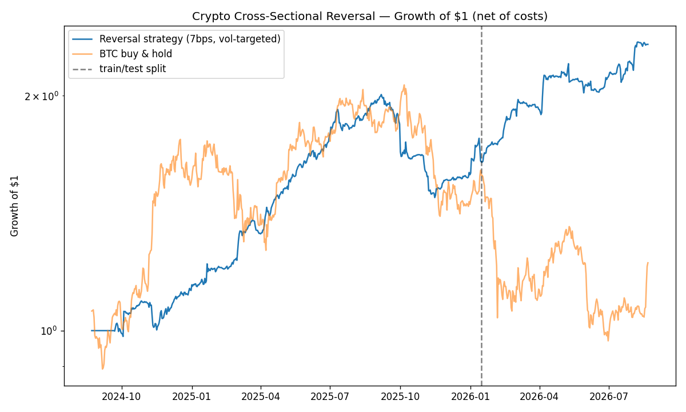

# Crypto Statistical Arbitrage — Cross-Sectional Reversal

A dollar-neutral, market-neutral statistical-arbitrage strategy on the 30 most
liquid, established crypto assets. Each day it goes **long the relative losers and
short the relative winners** and harvests the short-horizon reversal that dominates
crypto cross-sections. All results are **net of execution costs** and validated on
a **held-out out-of-sample** window.

## Headline results (net of costs, full 2-year sample)

Universe: 30 liquid USDT pairs · 729 daily bars (2024-08-23 → 2026-08-21) · market-neutral (β ≈ 0.03)

| Execution assumption | Sharpe | Ann. return | Ann. vol | Max drawdown | Alpha vs BTC | Beta vs BTC |
|---|---|---|---|---|---|---|
| **7 bps (limit orders)** | **2.46** | +49% | 20% | −25% | +49% | +0.03 |
| 20 bps (market orders) | 1.44 | +29% | 20% | −30% | +28% | +0.03 |

Out-of-sample (last 30% of history) the strategy actually strengthened
(Sharpe 3.55 @ 7 bps / 2.89 @ 20 bps) — the recent window was an especially
strong reversal regime, so the **full-sample and train numbers above are the
conservative read**.

The underlying signal is robust, not a lucky window: the cross-sectional reversal
**information coefficient is +0.10 with a t-stat of +8.1** over the 2-year panel
(printed by `run.py` — cost-free evidence, independent of the P&L assumptions).



## Why 7 bps is the headline

The assignment prices market orders at 20 bps and limit orders at 7 bps. A reversal
book *supplies* liquidity (it buys what others are dumping), so passive/limit fills
are the natural execution model — hence 7 bps is the headline and 20 bps is reported
as a conservative bound. Transaction cost is the entire game here: the gross signal
is very strong (Sharpe ~2.5), and the whole research effort is about keeping turnover
low enough to preserve it net of cost.

## Method

- **Universe:** top-30 USDT pairs by volume that *also* have ≥ 700 days of history
  (`data.build_universe`). Ranking by volume alone surfaces newly-listed coins and
  collapses the common window to a few weeks — filtering to established coins keeps a
  full 2-year backtest.
- **Signal:** long the day's relative losers, short the relative winners
  (negative of the cross-sectionally demeaned prior-day return), normalized to a
  **dollar-neutral, gross-1** book (the course's "unconstrained" style).
- **Turnover control:** a **no-trade band** (rebalance a name only when its target
  moves enough to pay for itself). The band width is chosen **on the training slice
  only**.
- **Risk normalization:** book-level **volatility targeting to a 15% budget** so the
  reported return and drawdown reflect a fixed risk level. Because the scaler is
  time-varying (trailing vol, lagged) it modestly shifts the Sharpe — full-sample
  band-only is 2.73 and the vol-targeted book is 2.46 at 7 bps — in exchange for
  interpretable, comparable risk. Realized vol lands near 20% (not exactly 15%)
  because of the 30-day estimation lag and the 3× leverage cap.
- **Costs:** `turnover × cost_bps`, reported at both 7 bps and 20 bps.

### What was tested and rejected (honest ablation)

Full-sample **net Sharpe** for each variant:

| Variant | 7 bps | 20 bps |
|---|---|---|
| reversal (raw) | +2.56 | +1.36 |
| **reversal + no-trade band** | **+2.73** | **+1.88** |
| reversal + band + per-name vol-scaling | +2.46 | +1.16 |
| reversal + band + volume filter | +2.01 | +1.15 |
| momentum sleeve (lookback 60) | +0.32 | +0.12 |

- **Per-name volatility scaling and the volume filter did not improve net returns**,
  so both are excluded from the final book.
- A **time-series momentum sleeve** looks good in-sample (Sharpe +1.21) but goes
  **negative out-of-sample (−1.45)** and drags a combined book down, so it is dropped
  from the final strategy and kept only as this negative result. Knowing what *not*
  to trade is part of the research.

## Performance evaluation

Reported by `run.py` for the final strategy at both cost levels, split into
TRAIN / TEST / FULL: annualized return, annualized vol, Sharpe, max drawdown, and
**alpha/beta vs BTC** (OLS of daily strategy returns on BTC). Beta ≈ 0.03 confirms
the book is genuinely market-neutral — the return is alpha, not disguised crypto beta.

## Run it

```bash
pip install -r requirements.txt
python run.py      # builds the universe, backtests, prints metrics, writes equity_curve.png + results.csv
pytest -q          # 30 unit tests: signals, backtest engine, metrics, pipeline
```

Data comes from the Binance.US public REST API (`api.binance.com` returns HTTP 451
from US networks; Binance.US exposes the identical endpoints). No API key required.

## Honest notes

- **Survivorship:** the universe is *currently* liquid/established coins, a mild
  survivorship bias (stated, not hidden).
- **Sample:** ~2 years / one 70-30 split. The signal's t-stat (+6.85) is strong, but a
  single test window is a limitation; a walk-forward split would strengthen it further.
- **Costs modeled as `turnover × cost_bps`;** real slippage depends on size and fills.
- **The no-trade band is selected once, on train, at 7 bps** and reused for the 20 bps
  report; the cost-optimal band could differ slightly at market-order pricing.
- **Test > train** because the recent period favored reversal — flagged rather than
  cherry-picked as the headline.
